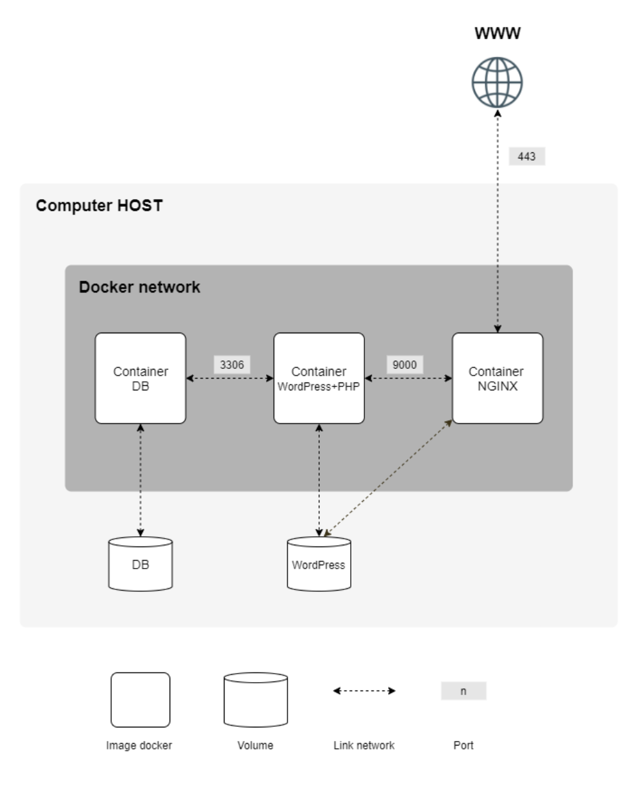

# Inception

간단한 모놀리식 아키텍쳐를 [alpine/debian]에서 빌드해보기

## 학습 기록

나는 더 낮은 용량을 가진 alpine기반으로 작성해 더 가벼운 서버를 만들어보고싶어 조금 더 무겁지만 자료는 많은 debian을 선택하지 않았다.

먼저 docker-compose로 volumn, network, .env로부터 가져온 환경변수, 의존성 등을 추가해준다.

nginx, wordpress, mariadb 세 컨테이너를 alpine 이미지를 기반으로 각각 따로 설치하고 설정하여 동작시킨다.

nginx는 간단하게 설치 후 config file만 제 위치에 넣어주면 된다

wordpress는 조금 복잡하게 core를 다운로드받아 admin 계정을 환경변수와 함께 설정해주는 스크립트를 작동시키면 된다.

mariadb는 이미지였다면 init.sql 하나만 잘 작성하면 끝나지만 해당 과제에선 aline 이미지를 사용해야했다.

dockerfile에서도 설치뿐만 아니라 필요한 dir에 권한 설정을 해줘야했고 config파일도 작성해 넣어주고 쉘 스크립트로 openrc를 활용하여 실행시키고 필요한 것들을 생성해주는 sql을 here_doc으로 넣어주면서 설정해주고 살아있는 상태로 유지하게 작성해줘야했다.

alpine 기반에서 직접 설치해야하다보니 검색해서 나온 방식대로 alpine linux에서 직접 하나하나 따라가보면서 확인하고 설정파일, 스크립트 작성을 했었는데 mariaDB에서만 권한 설정이 더 필요해서 많이 찾아보고 물어보러 다녔는데 다들 debian으로 해서 하나하나 수정해보면서 작동 할 때 까지 시도했다.

### 사용 실패...

과제를 통과한 시점에선 간신히 동작시켰었고 따로 문제 없었는데 지금 쓰는 m4 맥미니로는 못돌린다.

워드프레스 용량이 늘었는지 128m로는 부족해서 512m으로 올려줘야 다운로드된다. 그 부분은 해결 가능했다.

alpine 위에 직접 mariaDB를 설치하고 설정하는 과제다보니 일반적인 이미지 사용방법은 못쓰고 강제로 켜서 설정해주고 살려놓는 스크립트를 따로 작성해서 돌려야했어서 그런 권한 문제인 줄 알았다.

mac이 chmod, chown을 막고있어서 아예 안되는 것이었다.

42 클러스터가 맥에서 리눅스로 바뀌면서 지금 과제 진행하는 학생들은 다행이 이런 문제를 보진 않을 것 같다.

